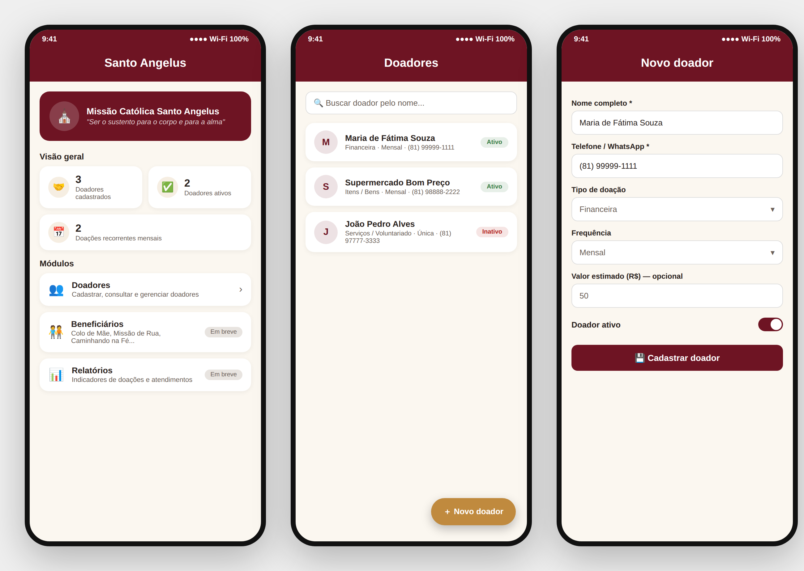

# Santo Angelus — Cadastro de Doadores (projeto base)

Projeto base em **Flutter/Dart** (web + mobile, mesmo código-fonte) para o
Trabalho Acadêmico de apoio tecnológico à ONG **Santo Angelus**.

Esta primeira entrega contém a estrutura do app e o módulo de
**cadastro, listagem, edição e remoção de doadores**, com os dados
guardados em memória (sem backend ainda) para permitir apresentar o
front funcionando hoje, sem depender de nenhum serviço externo.



## O que já funciona

- Painel inicial com indicadores (total de doadores, ativos, doações mensais);
- Cadastro de doador (nome, telefone, e-mail, endereço, tipo de doação,
  frequência, valor estimado, observações, status ativo/inativo);
- Listagem com busca por nome;
- Edição e remoção de um doador;
- Identidade visual provisória (cores bordô/dourado inspiradas no
  material institucional da ONG) — pronta para ser substituída pelo
  Figma oficial (ver `lib/core/theme/`).

## Como rodar

Pré-requisito: [Flutter SDK](https://docs.flutter.dev/get-started/install)
instalado (`flutter doctor` sem erros bloqueantes).

```bash
# 1) Dentro da pasta do projeto, gere as pastas de plataforma
#    (android/, ios/, web/...) compatíveis com a versão do Flutter
#    instalada na sua máquina. Isso não sobrescreve lib/ nem pubspec.yaml.
flutter create .

# 2) Instale as dependências
flutter pub get

# 3) Rode no navegador (mais rápido para apresentar)
flutter run -d chrome

# ...ou em um emulador/celular Android/iOS conectado
flutter run
```

> Por que o passo 1? Assim o projeto sempre gera os arquivos nativos
> (Gradle, Info.plist, index.html, etc.) já compatíveis com a versão do
> Flutter de quem for rodar, evitando os problemas mais comuns de
> "não roda na minha máquina" em projetos acadêmicos compartilhados por
> zip/repositório.

## Estrutura de pastas

```
lib/
  core/theme/         # cores e tema visual (placeholder da identidade da ONG)
  models/             # modelos de dados (Doador, enums)
  data/                # camada de acesso a dados (hoje: em memória)
  providers/           # estado da aplicação (Provider/ChangeNotifier)
  screens/             # telas (home, doadores)
  widgets/             # componentes reutilizáveis
  main.dart            # ponto de entrada do app
```

## Próximos passos (ver documentação completa do projeto)

1. Trocar o repositório em memória por um banco de dados real
   (Firebase Firestore ou API própria + PostgreSQL);
2. Aplicar a identidade visual definitiva a partir do protótipo Figma;
3. Autenticação/login para os voluntários responsáveis pelo cadastro;
4. Módulo de beneficiários (Colo de Mãe, Missão de Rua, Caminhando na
   Fé, Taekwondo) e relatórios.
